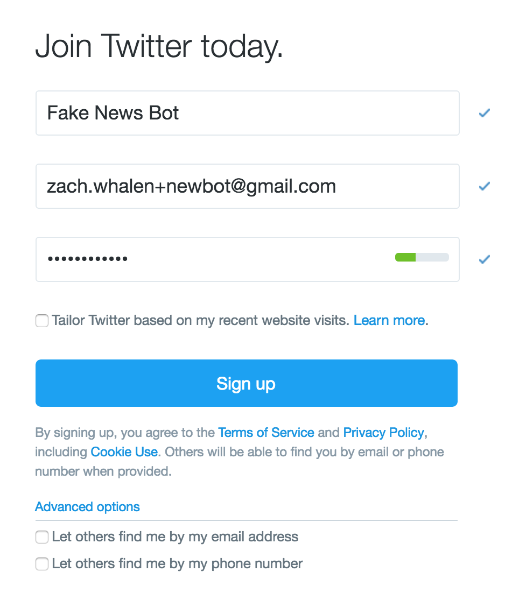

# SSBot

A tool for making a twitter bot using Google Spreadsheets. Because the software runs in Google Spreadsheets, and it requires the interaction of a specifically-constructed sheet with the underlying code specific to that sheet, this GitHub repo exists 

 * to point to the current, legacy, and in-development versions of the spreadsheet
 * to share the underlying code in a canonical way
 * to use <a href="http://github.com/zachwhalen/ssbot/issues">the issues tracker</a> for support and bug reports

The `.gs` files in this repository are the underlying GAS code for the dev version.

## Spreadsheets

To use one of these spreadsheets, "File -> Make a Copy..." to save it to your Google Drive.

<a href="https://docs.google.com/spreadsheets/d/1LeNW2BFuhB3MyeOuI51HakB6EC3ILXFjxSUtSrAsLaw/edit?usp=sharing">Current (v0.5.1)</a>

<a href="https://docs.google.com/spreadsheets/d/1Cbg_6pYN04XtDHpDLtxAP3ExQEBL8PYBXBQ1E5_Sq30/edit?usp=sharing">Legacy (v0.4)</a>

## Setup
A step-by-step guide for the legacy version is available <a href="http://www.zachwhalen.net/posts/how-to-make-a-twitter-bot-with-google-spreadsheets-version-04/
">on my website</a>.

### Step 1: Create your Bot’s Twitter Account

I like to do this first because it gives your bot a sense of identity while you work on it. You probably already know how to sign up for a Twitter account, so here are few tips:

 * **Use the “infinite gmail” trick for your bot’s email address.** This is the trick where you add “+something” to the name in your email. For example, my gmail address is “zach.whalen@gmail.com,” but I can also use something like “zach.whalen+myfakenewsbot@gmail.com” and it goes to the same inbox, which is convenient. Of course, if you want to really separate this bot from your real life, you can make a bespoke Gmail account.
 * **Opt out of everything.** Twitter changes this occasionally, but as of now, your account signup page includes three already-checked checkboxes that ***you should definitely uncheck***: “Tailor Twitter by my recent website visits”, “Let others find me by my email address,” and “Let others find me by my phone number.” The latter two will be hidden under “Advanced Options.”
 * **Do use a phone number.** This will save you a step later, and you can always disconnect this number after the bot set up is complete. Since you can only have one Twitter account per phone number, text “STOP” to 40404 to disconnect whichever account is currently connected to your phone.
 * **Don’t follow anyone, and don’t follow the bot from your real account.** Not until you’re ready for other people to find it.

You can customize your bot’s profile now or later, but I always like to give my bots an avatar picture, a nice background, and an informative bio that explains the bot purpose while disclosing its botness. 

### Step 2: Create your Twitter App

### Step 3: Authorize your spreadsheet with your API credentials

### Step 4: Choose and Configure a Constructor

### Step 5: Review some General Settings

### Step 6: Start Posting
